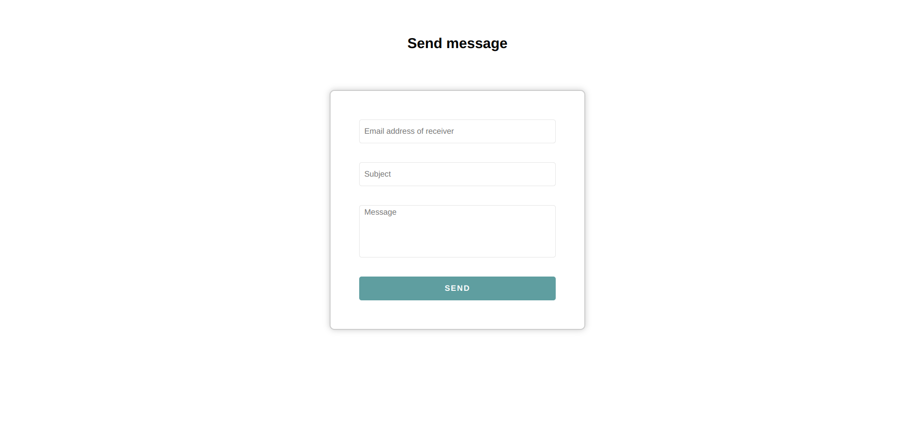

# Simple Nodemailer Project

This project is a simple application that demonstrates an example of how you can use nodemailer to send email from your websites.

The nodemailer has various applications:

- Contact forms
- Password reset forms
- Sending newsletters, etc.

## Setting up the project

1. Clone the project
2. Run `npm install` to install the dependencies
3. Create a `.env` file and add the following environment variables:
   - `EMAIL` - Your email address (for gmail, you need to enable less secure apps in your account settings)
   - `PASSWORD` - Your email password (for gmail, you need to generate an app password)
   - Others as shown in the `.env.example` file
4. Run `npm start` to start the server
5. Open your browser and navigate to `http://localhost:8000`

## Sending an email

To send an email, fill the form on the website and click the `Send` button.

## Screenshots

## Built with

- [Node.js](https://nodejs.org/)
- [Express](https://expressjs.com/)
- [Nodemailer](https://nodemailer.com/about/)
- [ejs](https://ejs.co/)
- [dotenv](https://www.npmjs.com/package/dotenv)

## Author

- [Sandesh G.C.](https://www.gcsandesh.com.np/)

## Future improvements

- Enable users to send attachments
- Enable users to send emails to multiple recipients
